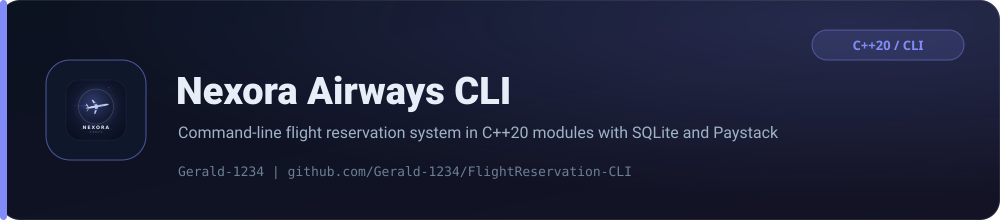

<p align="center">
  <picture>
    
  </picture>
</p>

<p align="center">
  <strong>A command-line flight reservation system for a fictional Nigerian airline, written in C++20 named modules.</strong>
</p>

<p align="center">
  
  
  
</p>
<p align="center">
  
  
  
</p>

Nexora Airways pairs an interactive console interface with SQLite persistence, Argon2id password hashing, a built-in account wallet and live Paystack payment processing.

## Features

| Feature | Description |
| --- | --- |
| Account roles | Customers and Admins, plus a protected super-admin account |
| Flight management (admin) | Create and edit flights between 21 Nigerian airports, set ticket prices, manage seat availability and review every booking |
| Booking (customer) | Search and book flights, view booked flights and cancel within a 30-minute cancellation window |
| Seat model | Economy, Business and First-Class cabins with window/aisle awareness and per-seat booking ownership |
| Flight status | Scheduled / Boarding / Departed / Delayed / Cancelled, updated automatically from the system clock |
| Account wallet | Deposit, withdraw and transfer funds between Nexora accounts, with loyalty points and a per-account transaction history |
| Paystack payments | Initialize a transaction, open the checkout page in the default browser, then verify the result; payment references are tracked so they cannot be reused |
| Secure authentication | Argon2id hashing with per-password salts and constant-time verification |
| Persistence | All flights, seats, accounts, transactions and bookings live in a single SQLite database |

## Requirements

- **OS:** Windows, Linux or macOS. The CMake build is fully cross-platform; the legacy `build.bat` path targets Windows (MSVC, or the MSYS2/Clang fallbacks).
- **Compiler** (any one): GCC 15+, Clang 16+ with libc++, or MSVC (v143/v145 toolset, Visual Studio 2022 or newer). All need `import std;`.
- **Build tools:** CMake 3.28+ and **Ninja** — CMake only implements `import std;` support with the Ninja generator.
- **Dependencies:** `argon2`, `curl`, `sqlite3` (and `zlib`). `nlohmann/json` is header-only and vendored under `third_party/`, patched for module linkage, for every platform.

On Windows dependencies come from vcpkg (`x64-windows-static` triplet); on Linux/macOS/MSYS2 they come from the system package manager via `pkg-config`.

| Platform | Install dependencies |
| --- | --- |
| Debian/Ubuntu | `sudo apt install cmake ninja-build pkg-config libargon2-dev libcurl4-openssl-dev libsqlite3-dev` |
| macOS | `brew install cmake ninja argon2 curl sqlite3` |
| Windows (vcpkg) | `vcpkg install argon2:x64-windows-static curl:x64-windows-static sqlite3:x64-windows-static zlib:x64-windows-static` |

## Build

### CMake (cross-platform, recommended)

```bash
./build/build.sh            # release
./build/build.sh debug      # debug
./build/build.sh --clean    # wipe the build directory first
```

This is equivalent to:

```bash
cmake --preset release
cmake --build --preset release
```

The executable is written to `build/cmake/release/NexoraAirways` (`NexoraAirways.exe` on Windows).

On Windows with MSVC + vcpkg, run from an **x64 Native Tools Command Prompt** with `VCPKG_ROOT` pointing at your vcpkg checkout:

```powershell
cmake --preset windows-msvc
cmake --build --preset windows-msvc
```

### Legacy Windows script (`build.bat`)

`build/build.bat` still works on Windows. It now tries **CMake + Ninja first** (when available), then falls back to **MSVC (MSBuild) → Clang → GCC** and stops at the first success. The legacy executable is emitted as `build/NexoraAirways.exe`.

```powershell
cd build
./build.bat
```

In Visual Studio: open `FlightReservation-CLI.slnx`, select the **x64** configuration and build (Ctrl+Shift+B).

### Debug symbols (`.pdb`)

PDB generation is disabled by default to keep the output directory clean. To produce a `.pdb` for debugging, edit `FlightReservation-CLI.vcxproj` and, for your configuration, set:

```xml
<ClCompile>
  <DebugInformationFormat>ProgramDatabase</DebugInformationFormat>
</ClCompile>
<Link>
  <GenerateDebugInformation>true</GenerateDebugInformation>
</Link>
```

Both values currently read `None` / `false`. Revert them to disable PDBs again.

## Configuration

Configuration is not committed. Copy the examples and fill in your own values:

```powershell
Copy-Item config/paystack_secret.example.txt config/paystack_secret.txt
Copy-Item config/super_admin.example.txt config/super_admin.txt
```

| File | Purpose |
| --- | --- |
| `config/paystack_secret.txt` | Paystack secret key (for example `sk_test_...`). Required for the payment flow |
| `config/super_admin.txt` | Optional override for the super-admin password |

If `super_admin.txt` is absent, the default super-admin credentials are:

| Field | Value |
| --- | --- |
| Username | `Shadow as admin.` |
| Password | `Kamar-Taj` |

To set a custom password:

```powershell
"YourSecurePassword123" | Out-File -Encoding utf8 config/super_admin.txt
```

## Running

```bash
# CMake build
./build/cmake/release/NexoraAirways
# Legacy Windows script
./build/NexoraAirways.exe
```

On first launch the app creates the `data/` directory, opens `data/flight_reservation.db`, and provisions the schema and super-admin account automatically. From the main menu you can create an account, log in as a customer or admin, and proceed to the role-specific menus.

## Project structure

```text
src/              C++20 module interfaces (*.ixx) and implementations (*.cpp)
third_party/      Vendored, module-patched nlohmann/json used on every platform
CMakeLists.txt    Cross-platform CMake build (MSVC / GCC / Clang)
CMakePresets.json Ninja presets for Linux, macOS and Windows MSVC + vcpkg
build/build.sh    Cross-platform build entry point (CMake)
build/build.bat   Windows script: CMake first, then MSVC -> Clang -> GCC
build/            (after building) the NexoraAirways[.exe] output
data/             flight_reservation.db, created and updated at runtime
config/           paystack_secret.txt and super_admin.txt, created from *.example.txt
icon/             Windows resource script and application icon
```

### Modules

| Module | Responsibility |
| --- | --- |
| `crypto` | Argon2id password hashing and verification |
| `seats` | Seat hierarchy (Economy/Business/First) and cabin logic |
| `flights` | Flight data, status transitions and seat allocation |
| `users` | Customer/Admin models, wallet and account persistence |
| `payment` | Paystack initialize/verify and Naira to Kobo conversion |
| `sqlite3db` | Singleton SQLite connection and schema management |
| `menus` | Interactive CLI menus and user flows |

## Security notes

- Passwords are hashed with **Argon2id** (2 iterations, 128 MiB memory, single thread, 128-byte output) using a unique salt per password.
- Password verification compares hashes in constant time.
- Paystack requests use Bearer-token auth over TLS with a 30-second timeout; the secret key is read from `config/` and never stored in the database or source.
- The super-admin account is protected from deletion and excluded from bulk account listings.

## License

Released under the [MIT License](LICENSE).

<p align="center"><sub>Built and maintained by <a href="https://github.com/Gerald-1234">Gerald-1234</a></sub></p>
